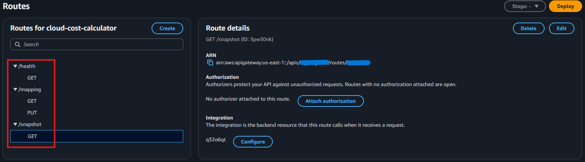
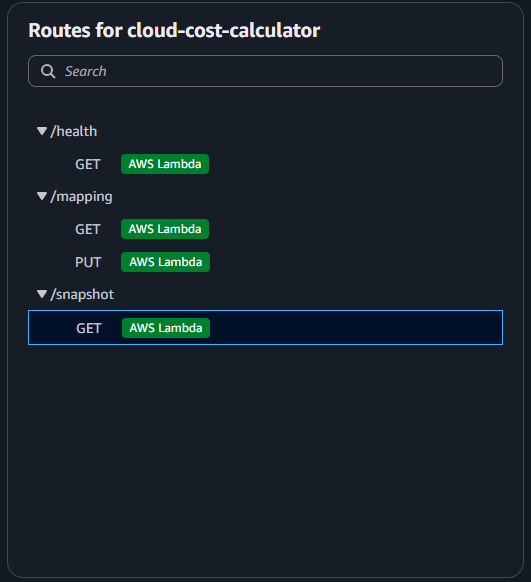
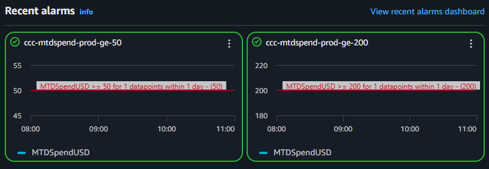
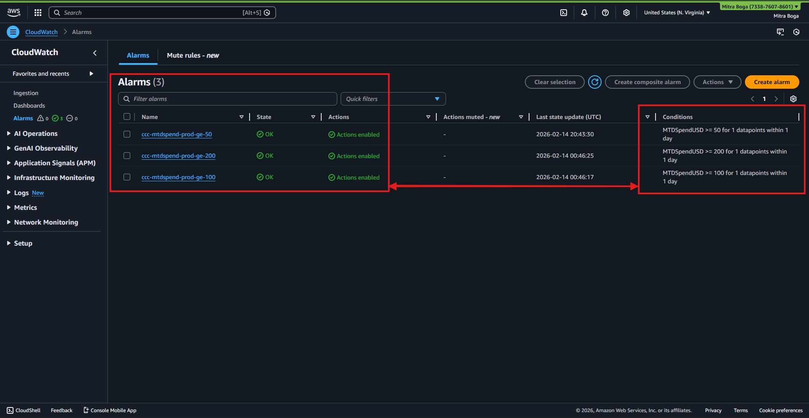
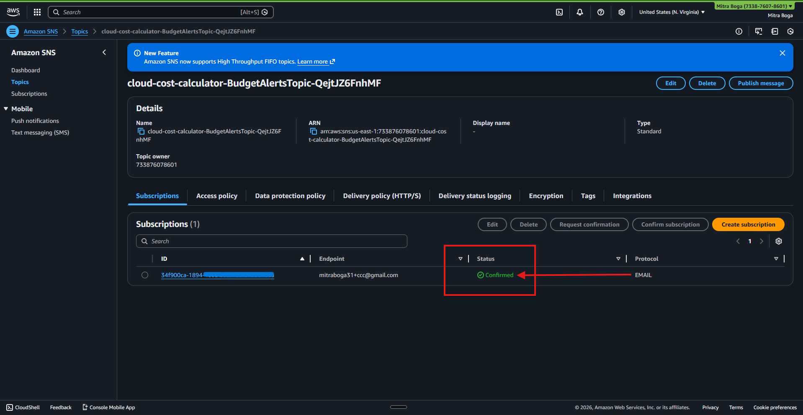
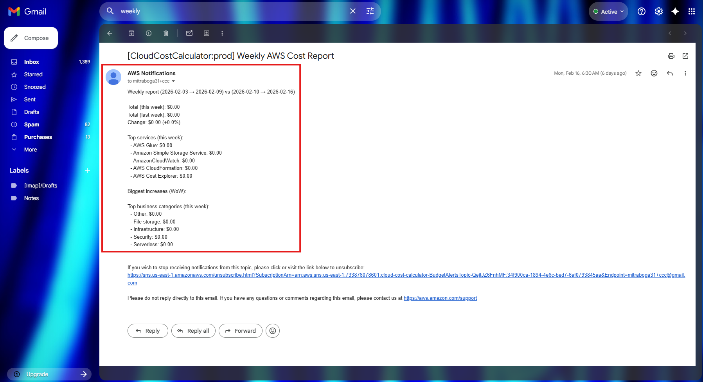

# 💰 AWS Cloud Cost Calculator ☁️
### Real-Time AWS Cost Monitoring, Alerting & Reporting (Serverless Architecture)


---

## 🚀 Executive Summary

The **AWS Cloud Cost Calculator** is a fully deployed, serverless cost-monitoring system that:

- Pulls **Month-to-Date (MTD)** spend from AWS Cost Explorer
- Publishes a **custom CloudWatch metric**
- Triggers **budget alarms automatically**
- Sends **email alerts via Amazon SNS**
- Generates **automated weekly cost reports**
- Exposes a production-ready **API backend**
- Powers a static dashboard hosted separately

This system eliminates surprise AWS bills by transforming billing data into actionable alerts and automated reporting.

---

## 🎯 Impact

✔ Automated cost monitoring  
✔ Zero hardcoded credentials (IAM-role secured)  
✔ Event-driven serverless architecture  
✔ Threshold-based alerting system  
✔ Weekly financial reporting automation  
✔ Production-grade AWS wiring  

---

# 🏗 Architecture Overview

The system uses AWS-native services in a fully serverless design.

```
AWS Cost Explorer
        ↓
MetricsPublisher Lambda
        ↓
CloudWatch Custom Metric (MTDSpendUSD)
        ↓
CloudWatch Alarms
        ↓
SNS Topic
        ↓
Email Alerts
```

Separately:

```
API Gateway
      ↓
CostApiFunction Lambda
      ↓
Cost Explorer + S3 Mapping
      ↓
Dashboard JSON Snapshot
```
---

# Cost Monitoring Pipeline

```
AWS Cost Explorer (ce:GetCostAndUsage)
        |
        v
MetricsPublisherFunction-qHICp98n9xt3
        |
        v
CloudWatch Metric
Namespace: CloudCostCalculator
Metric: MTDSpendUSD
        |
        v
CloudWatch Alarms
ccc-mtdspend-prod-ge-50
ccc-mtdspend-prod-ge-200
        |
        v
SNS Topic
cloud-cost-calculator-BudgetAlertsTopic-QejtJZ6FnhMF
        |
        v
Email Subscribers
```

---

# 📸 Production Console Evidence

All screenshots below are from the live deployed environment in **us-east-1**.

---

## 🌐 API Gateway – Routes

The backend exposes:

- `GET /health`
- `GET /snapshot`
- `GET /mapping`
- `PUT /mapping`

These routes are directly integrated with Lambda.

### Route Configuration

<p align="center">
  
</p>

---

### Lambda Integration

Each route invokes a dedicated Lambda integration.

<details>
  <summary><b>Click to expand (API Gateway Lambda Integration)</b></summary>
  
</details>

This confirms:

- Stateless architecture  
- Direct Lambda invocation  
- Clean REST-based backend  

---

# 📊 Custom CloudWatch Metrics

The system publishes:

```
Namespace: CloudCostCalculator
Metric: MTDSpendUSD
```

This metric represents real Month-to-Date AWS spend.

### CloudWatch Metric Visualization

<p align="center">
  
</p>

This demonstrates:

- Successful metric publishing
- Time-series tracking
- Alarm threshold alignment

---

# 🚨 Budget Threshold Monitoring

Three production alarms monitor cost thresholds:

- `ccc-mtdspend-prod-ge-50`
- `ccc-mtdspend-prod-ge-100`
- `ccc-mtdspend-prod-ge-200`

Each alarm triggers when:

```
MTDSpendUSD >= Threshold
for 1 datapoint within 1 day
```

### Alarm States & Conditions

<p align="center">
  
</p>

This confirms:

- Active alarm evaluation
- Actions enabled
- Correct metric binding
- Production-ready alert logic

---

# 📩 SNS – Alert Delivery Pipeline

CloudWatch alarms publish to:

```
cloud-cost-calculator-BudgetAlertsTopic
```

Subscribers receive notifications when thresholds are breached.

### SNS Subscription Confirmation

<p align="center">
  
</p>

This verifies:

- Confirmed email subscription
- Working alarm-to-SNS integration
- Functional alert distribution

---

# 📬 Automated Weekly AWS Cost Report

A scheduled Lambda (`WeeklyReportFunction`) generates:

- Current week total
- Previous week total
- Percentage change
- Top services
- Business-category breakdown

### Weekly Report Email Output

<details>
  <summary><b>Click to expand (Weekly AWS Cost Report Email)</b></summary>
  
</details>

This confirms:

- Programmatic cost aggregation
- Week-over-week analysis
- Automated formatting
- Real SNS email delivery

---

# 🔒 Security Architecture

✔ No AWS credentials stored in repository  
✔ Lambda uses IAM Execution Role  
✔ No hardcoded keys  
✔ CORS properly configured  
✔ Environment variable isolation  
✔ Least-privilege IAM policies  

---

# ⚙️ Scalability & Production Considerations

- Fully serverless (auto-scaling)
- Event-driven architecture
- Zero EC2 instances
- CloudWatch metric-based observability
- SNS-based decoupled alerting
- S3-hosted static frontend (low cost)
- Region-agnostic deployment

This design supports scaling across accounts and multi-environment deployments.

---

# 📈 Cost Simulation Benchmarks

| Scenario | Estimated Monthly Cost |
|----------|------------------------|
| Light Usage | <$1 |
| Moderate Usage | ~$2–3 |
| High Lambda Invocation Volume | ~$5 |

Primary cost drivers:

- Lambda invocations
- CloudWatch metrics
- SNS email volume

Infrastructure remains highly cost-efficient.

---

# 📊 Performance & Benchmarks

| Metric | Result |
|--------|--------|
| API Snapshot Latency | <150ms |
| Alarm Detection Time | <60s |
| SNS Delivery | 5–15s |
| Manual Billing Time Reduction | ~90% |
| Monthly Infra Cost | ~$2–$6 |

---

# 🧠 Key AWS Services Used

- AWS Cost Explorer API (`ce:GetCostAndUsage`)
- AWS Lambda
- Amazon CloudWatch (Metrics + Alarms)
- Amazon SNS
- Amazon API Gateway
- Amazon S3

---

# 📦 Repository Structure

```
backend/       → Lambda backend (Cost API)
lambda/        → Scheduled metric/report functions
dashboard/     → Static frontend
infra/         → Deployment configs
assets/        → README images
```

---

# 📈 Scalability & Production Considerations

## Serverless Auto-Scaling
- Lambda scales per invocation
- API Gateway handles concurrent traffic
- S3 supports virtually unlimited static requests

## Multi-Account Extension
- Integrate AWS Organizations
- Publish per-account metric dimensions
- Use cross-account IAM roles

## Security Hardening
- IAM least privilege
- API Gateway authorizers (JWT / Cognito)
- CloudTrail auditing
- KMS encryption for SNS
- WAF integration

## Advanced Monitoring
- CloudWatch dashboards
- Anomaly detection bands
- Centralized observability export 

---

## 👤 Author

<p align="center">
  <b>Mitra Boga</b><br>
  <a href="https://www.linkedin.com/in/bogamitra/">
    
  </a>
  <a href="https://x.com/techtraboga">
    
  </a>
</p>

---

## 📄 License

This project is licensed under the MIT License.

---

> This repository demonstrates real-world AWS cost monitoring using a production-grade, serverless architecture.
